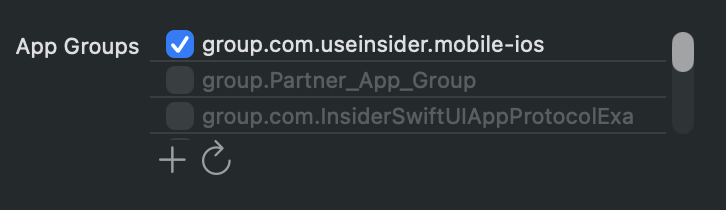
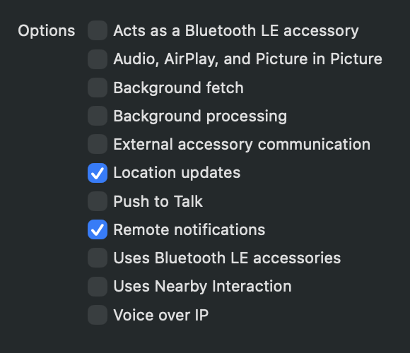

# Insider Flutter SDK Example

[](https://pub.dev/packages/flutter_insider)

<p align="center">
  
</p>

<p align="center">
  <a href="https://insiderone.com/">Insider</a> &bull;
  <a href="https://academy.insiderone.com/docs/flutter-integration">Documentation</a> &bull;
  <a href="https://pub.dev/packages/flutter_insider">pub.dev</a> &bull;
  <a href="LICENSE">MIT License</a>
</p>

This project demonstrates how to integrate the [Insider Flutter SDK](https://academy.insiderone.com/docs/flutter-integration) into a Flutter application on **iOS** and **Android**. One Dart codebase drives both platforms; the `flutter_insider` plugin brings the native Insider SDKs with it. On iOS the native SDKs can be resolved with **Swift Package Manager** or **CocoaPods**, on Android they come from the Insider Maven repository through Gradle. The app includes working examples of every major SDK feature, the two iOS push notification extensions, and Firebase / Huawei push on Android.

## Requirements

| Requirement | Minimum |
|---|---|
| Flutter | 3.24 (Swift Package Manager support) |
| Dart | 3.0 |
| iOS | 15.6, Xcode 15 |
| Android | API 24 (Android 7.0), compile and target SDK 36 |
| Android Gradle Plugin | 8.13 (Gradle 9.1) |
| JDK | 17 |

## Project Structure

```
lib/
├── main.dart                        # SDK initialization & callback handler
├── components/                      # Shared widgets
└── insider/                         # One page per SDK feature
    ├── UserAttribute.dart, UserIdentifier.dart
    ├── Event.dart, Product.dart, Purchase.dart, Wishlist.dart
    ├── SmartRecommender.dart, ContentOptimizer.dart
    ├── PageVisit.dart, GDPR.dart, Geofence.dart
    ├── InAppMessages.dart
    └── MessageCenter.dart, MessageCenterInboxPage.dart

ios/
├── Podfile                          # Adds InsiderMobileAdvancedNotification to Runner in CocoaPods mode
├── Runner/                          # AppDelegate, SceneDelegate, Info.plist, entitlements
├── InsiderNotificationService/      # Rich push (Service Extension)
│   └── NotificationService.swift
└── InsiderNotificationContent/      # Interactive push (Content Extension)
    ├── NotificationViewController.swift
    └── InsiderInterface.storyboard

android/
├── build.gradle                     # Insider & Huawei Maven repositories, plugin classpaths
├── settings.gradle                  # AGP / Kotlin plugin versions
└── app/
    ├── build.gradle                 # applicationId, partner placeholder, signing
    ├── google-services.json         # Firebase (git-ignored, you provide it)
    ├── agconnect-services.json      # Huawei (git-ignored, you provide it)
    └── src/main/
        ├── AndroidManifest.xml      # Permissions, launcher activity
        └── kotlin/.../MainActivity.kt
```

| Platform | Dependency Manager | SDKs |
|---|---|---|
| iOS | Swift Package Manager | InsiderMobile, InsiderGeofence, InsiderHybrid, InsiderMobileAdvancedNotification (from the `Insider-iOS-SDK` package) |
| iOS | CocoaPods | InsiderMobile, InsiderGeofence, InsiderHybrid (from the `flutter_insider` podspec), InsiderMobileAdvancedNotification |
| Android | Gradle (Maven) | `com.useinsider:insider`, `com.useinsider:insiderhybrid`, Firebase Messaging, Play Services Location, Huawei Push / Location |

The two iOS notification extensions are shared by both dependency managers. They link `InsiderMobileAdvancedNotification` from `Runner.app` and carry their own `InsiderInterface.storyboard`, so nothing in them changes when you switch channels.

## Getting Started

### 1. Clone the Repository

```bash
git clone git@github.com:useinsider/FlutterDemo.git
cd FlutterDemo
flutter pub get
```

### 2. Configure Your App

Every value you must replace is marked with a `FIXME-INSIDER` comment; search for that key to find them all.

#### Dart (both platforms)

**Partner Name** and **App Group** in [`lib/main.dart`](lib/main.dart). The app group is only used on iOS, but the same call initializes both platforms:

```dart
await FlutterInsider.Instance.init(
    "YOUR_PARTNER_NAME", "YOUR_APP_GROUP",
    (int type, dynamic data) { /* ... */ });
```

#### iOS

1. **App Group** identifier in all of these files. It must be identical everywhere, and the App Groups capability must be enabled for all three bundle identifiers in your Apple Developer account:
   - `appGroup` in [`ios/InsiderNotificationService/NotificationService.swift`](ios/InsiderNotificationService/NotificationService.swift)
   - `appGroup` in [`ios/InsiderNotificationContent/NotificationViewController.swift`](ios/InsiderNotificationContent/NotificationViewController.swift)

2. **Signing & Capabilities** for every target (`Runner` + both extensions):
   - Set your bundle identifiers; the extension identifiers must be prefixed with the app identifier
   - Set your development team
   - Enable **Push Notifications**
   - Add an **App Groups** capability with the same identifier used above

   

   - Enable **Background Modes**: Remote notifications, Location updates

   

> **Important:** The App Group identifier must be identical across the main app target, both notification extension targets and the `init` call in `lib/main.dart`. A mismatch will prevent the SDK from sharing data between the app and its extensions.

3. **URL Scheme**: In the `Runner` target's **Info** tab under **URL Types**, set the scheme to match your partner name (e.g., `insideryourpartnername`). This is what lets you register a test device from the panel with a QR code or e-mail.

#### Android

Update the following values in [`android/app/build.gradle`](android/app/build.gradle):

- **Partner Name** — the SDK reads it from the manifest placeholder; it must match the name passed to `init` in Dart. This is also what lets you register a test device from the panel with a QR code or e-mail:

```groovy
manifestPlaceholders = [ 'partner': 'YOUR_PARTNER_NAME' ]
```

- **Application ID** — must match the package registered in your `google-services.json`:

```groovy
applicationId "com.your.package.name"
```

- **Firebase** — drop your `google-services.json` into `android/app`. The file is git-ignored.

- **Huawei** — drop your `agconnect-services.json` into `android/app`. The file is git-ignored. The build applies the AppGallery Connect plugin, so the file is required even if you do not ship to Huawei devices; alternatively remove the `com.huawei.agconnect` lines from `android/build.gradle` and `android/app/build.gradle` and use the `-nh` (no Huawei) variant of `flutter_insider` from pub.dev.

- Optionally change the app label in [`android/app/src/main/AndroidManifest.xml`](android/app/src/main/AndroidManifest.xml).

### 3. Install Dependencies

#### iOS

Choose one of the following methods. The choice is a Flutter setting; the Xcode project is the same for both.

<details>
<summary><strong>Swift Package Manager</strong></summary>

```bash
flutter config --enable-swift-package-manager
flutter pub get
```

Flutter generates a Swift package that depends on the `flutter_insider` package, which in turn resolves the native SDKs from [`Insider-iOS-SDK`](https://github.com/useinsider/Insider-iOS-SDK). `flutter build ios` still runs `pod install` for the remaining CocoaPods integration; that is expected.

</details>

<details>
<summary><strong>CocoaPods</strong></summary>

```bash
flutter config --no-enable-swift-package-manager
flutter pub get
```

`pod install` runs as part of `flutter build ios`. If you run it by hand, always run `flutter pub get` first: the `Podfile` reads the channel Flutter recorded in `.flutter-plugins-dependencies` and adds `InsiderMobileAdvancedNotification` to the `Runner` target only in CocoaPods mode.

```ruby
target 'Runner' do
  use_frameworks!
  use_modular_headers!

  flutter_install_all_ios_pods File.dirname(File.realpath(__FILE__))
  pod "InsiderMobileAdvancedNotification" unless swift_package_manager_enabled?

  target 'InsiderNotificationContent' do
    inherit! :search_paths
  end

  target 'InsiderNotificationService' do
    inherit! :search_paths
  end
end
```

</details>

> **Note:** Switching channels makes `pod install` add or remove the `[CP]` build phases in `ios/Runner.xcodeproj/project.pbxproj`. That diff is expected and safe to discard. After changing the native Insider SDK version, run `flutter clean` and delete `~/Library/Developer/Xcode/DerivedData/Runner-*`.

#### Android

No extra steps: the Gradle wrapper downloads itself on first build and the `flutter_insider` plugin declares the native SDKs (`com.useinsider:insider`, `com.useinsider:insiderhybrid`, Firebase Messaging, Play Services Location, Huawei Push / Location). The Insider and Huawei Maven repositories are already declared in [`android/build.gradle`](android/build.gradle):

```groovy
allprojects {
    repositories {
        google()
        mavenCentral()
        maven { url "https://mobilesdk.useinsider.com/android" }
        maven { url "https://developer.huawei.com/repo/" }
    }
}
```

> **JDK note:** Gradle 9.1 runs on JDK 17 or newer. If Flutter picks an older JDK, point it at Android Studio's bundled runtime:
> ```bash
> flutter config --jdk-dir "/Applications/Android Studio.app/Contents/jbr/Contents/Home"
> ```

### 4. Build and Run

```bash
flutter run                      # on a connected device, simulator or emulator
flutter build ios --simulator    # iOS, build only
flutter build apk --debug        # Android, build only
```

To work from Xcode, generate the project configuration first, then open the workspace and run the `Runner` scheme:

```bash
flutter build ios --config-only
open ios/Runner.xcworkspace
```

To work from Android Studio, open the project root with the Flutter plugin installed, or open the `android` folder for Gradle-only work.

## SDK Initialization

The SDK is initialized once, in Dart, for both platforms. See [`lib/main.dart`](lib/main.dart):

```dart
import 'package:flutter_insider/flutter_insider.dart';
import 'package:flutter_insider/enum/InsiderCallbackAction.dart';

Future initInsider() async {
  await FlutterInsider.Instance.init(
      "YOUR_PARTNER_NAME", "YOUR_APP_GROUP",
      (int type, dynamic data) {
    switch (type) {
      case InsiderCallbackAction.NOTIFICATION_OPEN:
        // Handle push notification tap
        break;
      case InsiderCallbackAction.TEMP_STORE_CUSTOM_ACTION:
        // Handle e-commerce events
        break;
      default:
        break;
    }
  });

  // Show push notifications while the app is in the foreground (iOS)
  FlutterInsider.Instance.setActiveForegroundPushView();
  // Request the push permission (iOS prompt / Android 13+ POST_NOTIFICATIONS)
  FlutterInsider.Instance.registerWithQuietPermission(false);
  FlutterInsider.Instance.enableIDFACollection(true);
  FlutterInsider.Instance.enableIpCollection(true);
  FlutterInsider.Instance.enableCarrierCollection(true);
  FlutterInsider.Instance.enableLocationCollection(true);
  FlutterInsider.Instance.startTrackingGeofence();
}
```

## Push Notifications

### iOS: Notification Extensions

The SDK requires two notification extensions on iOS for full push notification support:

- **Notification Service Extension** — Intercepts incoming push notifications to download rich media (images, videos) before display. See [`ios/InsiderNotificationService/NotificationService.swift`](ios/InsiderNotificationService/NotificationService.swift).
- **Notification Content Extension** — Provides an interactive carousel UI for expanded push notifications. See [`ios/InsiderNotificationContent/NotificationViewController.swift`](ios/InsiderNotificationContent/NotificationViewController.swift).

Both extensions must share the same **App Group** identifier as the main app target. Refer to the source files for the complete implementation.

The Notification Content Extension's `Info.plist` must include the following entries:

```xml
<key>NSExtension</key>
<dict>
    <key>NSExtensionAttributes</key>
    <dict>
        <key>UNNotificationExtensionCategory</key>
        <string>insider_int_push</string>
        <key>UNNotificationExtensionDefaultContentHidden</key>
        <true/>
        <key>UNNotificationExtensionInitialContentSizeRatio</key>
        <real>0.5</real>
    </dict>
    <key>NSExtensionMainStoryboard</key>
    <string>InsiderInterface</string>
    <key>NSExtensionPointIdentifier</key>
    <string>com.apple.usernotifications.content-extension</string>
</dict>
```

#### Storyboard Setup

This project keeps [`InsiderInterface.storyboard`](ios/InsiderNotificationContent/InsiderInterface.storyboard) inside the Notification Content Extension target, so the same setup works with both Swift Package Manager and CocoaPods and nothing has to be edited after `pod install`.

The storyboard references `NotificationViewController` without a module. The Swift class is therefore declared with `@objc(NotificationViewController)`, which keeps its Objective-C name unmangled so the storyboard can resolve it at runtime. Keep that attribute if you rename or move the class.

### Android: Firebase and Huawei

No messaging service code is needed in the app. The `flutter_insider` plugin depends on Firebase Cloud Messaging and Huawei Push and hands Insider messages to the SDK itself; you only supply the configuration files:

- `android/app/google-services.json` — read by the Google Services plugin at build time.
- `android/app/agconnect-services.json` — read by the AppGallery Connect plugin at build time.

Both plugins are applied at the end of [`android/app/build.gradle`](android/app/build.gradle):

```groovy
apply plugin: 'com.google.gms.google-services'
apply plugin: 'com.huawei.agconnect'
```

## Runtime Permissions (Android)

Insider features that touch OS-protected resources need both a `<uses-permission>` entry in the manifest **and** a runtime request on Android 6.0+ (API 23+). The manifest entry alone is not sufficient.

| Feature | Permission(s) | Required from |
|---|---|---|
| Push notifications (FCM/HMS) | `POST_NOTIFICATIONS` | Android 13 (API 33) |
| Geofence tracking | `ACCESS_FINE_LOCATION`, `ACCESS_COARSE_LOCATION` | Android 6 (API 23) |
| Background geofence | `ACCESS_BACKGROUND_LOCATION` | Android 10 (API 29), separate flow |

The demo declares them in [`android/app/src/main/AndroidManifest.xml`](android/app/src/main/AndroidManifest.xml):

```xml
<uses-permission android:name="android.permission.POST_NOTIFICATIONS" />
<uses-permission android:name="android.permission.ACCESS_FINE_LOCATION" />
<uses-permission android:name="android.permission.ACCESS_BACKGROUND_LOCATION" />
```

`registerWithQuietPermission(false)` in the initialization above triggers the push permission prompt. Location permissions must be requested by the app before calling `startTrackingGeofence()`; use a package such as `permission_handler` for that in your own app.

## License

This project is licensed under the MIT License. See the [LICENSE](LICENSE) file for details.
